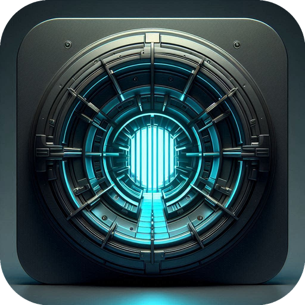

<p align="center">
  
</p>

# QuestVault

QuestVault is a desktop Quest content manager for local library indexing, headset inventory, save backup workflows, ADB operations, and vrSrc-assisted remote catalog downloads.

## Inspiration

This project is heavily inspired by the fantastic work done on [Rookie Sideloader](https://github.com/nerdunit/androidsideloader), ApprenticeVR, and ApprenticeVR vrSrc Edition.

## Core Areas

### Apps & Games

- Local library catalog with gallery and list layouts.
- Search-first workflow across local payloads, backup payloads, and metadata-enriched titles.
- Version-aware duplicate handling:
  - latest version shown during normal browsing
  - full matching variants visible during search
  - older local versions removable from the latest version's detail drawer
- Manual install entry points for APK files and folders.
- One-click metadata refresh for indexed titles.
- Detail drawer with artwork, description, category chips, versions, package ID, store ID, folder name, and install actions.
- Resilient artwork fallback rendering so broken image links fall back to generated cover art instead of empty panels.
- Local, vrSrc, and save-management drawers now hand long-running actions off to the Live Queue more consistently so progress and blocked outcomes surface in one place.
- Detail drawers across Local Library, vrSrc, Installed Inventory, and Game Saves are now more aligned, with shared rating strips, trailer embeds, richer metadata facts, and clearer section separation.
- Selected toolbar and filter pills now use the same warm highlighted surround treatment as the active left-rail navigation item.
- Local Library and vrSrc summary pills now use clearer wording and filtering behavior: Local Library shows `Library`, while vrSrc `Updates` displays the count and leaves update filtering to the global filter row.
- vrSrc drawer wrapping is now more resilient for long package names, trailer headers, note content, and manual patch strings, so problem entries no longer blow the drawer out sideways.

### Installed Inventory

- Headset-installed apps and games inventory.
- Independent grid/list display preference persistence.
- Installed-state actions such as uninstall and backup.
- Installed-app refresh now reuses the persisted installed metadata index and only hydrates packages that are still missing metadata after a scan.

### ADB Manager

- Managed ADB readiness surface.
- USB/Wi-Fi connection support.
- Connected device overview with storage and installed-app count.
- Device-centric operational feedback through the Live Queue.

### Game Saves

- Live save scan of the selected headset.
- Save backup creation.
- Per-title headset save scans from the drawer, without forcing a full save scan across the headset.
- Save restore from stored snapshots.
- Save backup deletion.
- Combined visibility for installed save targets and backup-only history.
- Metadata-enriched save drawers with storefront rating, trailer support, descriptions, and player-mode / comfort / supported-device fields when a store match exists.

### Settings

- Path configuration for Local Library, Backup Storage, and Game Saves.
- Index totals and storage statistics.
- Local library rescan and review tools.
- Backup-storage maintenance actions.
- Leftover-data scan for device cleanup decisions.

## User Experience Features

- Shared Live Queue for operational transparency.
- Metadata-enriched artwork and descriptions where available.
- Manual metadata override tools for local entries that lack clean store matches.
- Background refresh patterns that keep the app usable while scans and enrichment continue.
- Installed-app refreshes are now coalesced after install and uninstall bursts so Live stays readable during multi-step device operations.
- Installed-app metadata refresh now begins from the persisted installed index, trims removed packages, and backfills only missing matches in the background.
- Watcher-driven updates when indexed folders change on disk.
- Windows vrSrc sync now prefers IPv4 for remote source requests to avoid Cloudflare 403 failures seen on some IPv6 paths.
- vrSrc sync and payload transfers now use a managed `rclone` transport while Telegram credential resolution stays on `curl`, which restores the public `meta.7z` sync path on networks where older request profiles are blocked.
- Older managed or system `rclone` binaries are now version-checked and automatically refreshed when they are below the working minimum used for vrSrc sync.
- Save drawer package IDs now wrap cleanly instead of forcing sideways scroll on long package names.
- vrSrc-style `v<code>+<name>` release names are now parsed consistently during vrSrc sync and local indexing, which improves version fallback accuracy for vrSrc-style payload folders.

- [QuestVault Screenshots](screenshots/)

## Packaging and Platform Status

- Electron desktop app.
- Current build targets configured for:
  - macOS
  - Windows
  - Linux

## Current Product Position

QuestVault currently functions as:

- a Quest device operations console
- a local archive and install manager
- a backup-storage organizer
- a save-state backup and restore tool
- a metadata-enriched review layer over local and headset content

## Development

The app uses Electron 36 + React 19 + TypeScript at its core.

```bash
pnpm install
pnpm dev
pnpm typecheck
pnpm build
```

## Packaging

Build targets are configured for:

- macOS (`dmg`, `zip`)
- Windows (`nsis`, `zip`)
- Linux (`AppImage`, `tar.gz`)

Active build icon assets live under `build/icons/`.

## Documentation

- [Architecture](docs/ARCHITECTURE.md)
- [Capabilities](docs/CAPABILITIES.md)
- [Features](docs/FEATURES.md)
- [Build & Packaging](docs/BUILD.md)
- [User Manual](docs/MANUAL.md)
